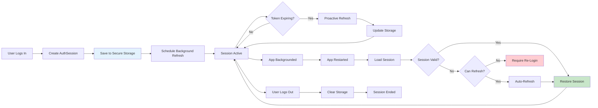
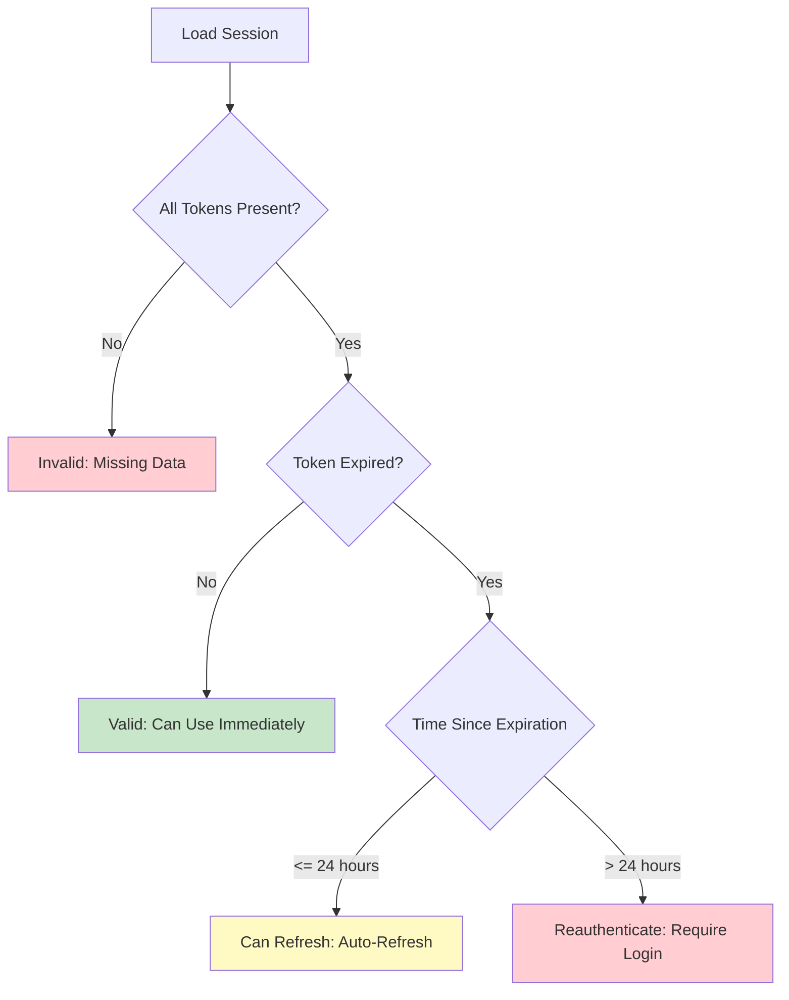

# Session Management Guide

## Overview

This guide explains how authentication sessions are managed in the SoloAdventurer app, including session creation, storage, validation, restoration, and cleanup. The session management system ensures users stay logged in across app restarts while maintaining security.

## Table of Contents

- [Session Lifecycle](#session-lifecycle)
- [Session Storage](#session-storage)
- [Session Validation](#session-validation)
- [Session Restoration](#session-restoration)
- [Session Security](#session-security)
- [API Reference](#api-reference)
- [Best Practices](#best-practices)

## Session Lifecycle

### Mermaid Diagram



### Lifecycle Stages

#### 1. Session Creation

When a user successfully logs in or registers:

```dart
// In AuthRepositoryImpl
Future<User> signInWithEmailAndPassword(String email, String password) async {
  // 1. Authenticate with Cognito
  final authResult = await _cognitoUser.signIn(email, password);

  // 2. Create AuthSession
  final session = AuthSession(
    accessToken: authResult.accessToken,
    idToken: authResult.idToken,
    refreshToken: authResult.refreshToken,
    expiresAt: DateTime.now().add(Duration(hours: 1)), // AWS Cognito: 1 hour
  );

  // 3. Save to secure storage
  await _persistentSessionManager.saveSession(session);

  // 4. Schedule background refresh
  await _backgroundRefreshScheduler.updateSession(session);

  return user;
}
```

#### 2. Session Active

While the session is active:

- **Proactive Refresh**: Token refresh is triggered at 75% of lifetime (~45 minutes)
- **Reactive Refresh**: If a 401 error occurs, token is refreshed and request is retried
- **Background Monitoring**: RefreshScheduler monitors app lifecycle and pauses/resumes

#### 3. Session Restoration

When the app restarts:

```dart
// In AuthProvider initialization
Future<void> initialize() async {
  // 1. Load and validate session
  final validationResult = await _persistentSessionManager.validateSessionForRestoration();

  switch (validationResult.action) {
    case SessionValidationAction.valid:
      // Session is valid, restore it
      state = state.copyWith(
        isAuthenticated: true,
        session: validationResult.session,
      );
      await _backgroundRefreshScheduler.start(validationResult.session!);
      break;

    case SessionValidationAction.canRefresh:
      // Session recently expired, attempt refresh
      try {
        final newSession = await _authRepository.refreshToken();
        state = state.copyWith(
          isAuthenticated: true,
          session: newSession,
        );
        await _backgroundRefreshScheduler.start(newSession);
      } catch (e) {
        // Refresh failed, require re-authentication
        _navigateToLogin();
      }
      break;

    case SessionValidationAction.reauthenticate:
      // Session expired > 24 hours ago, require re-login
      _navigateToLogin();
      break;

    case SessionValidationAction.invalid:
      // No valid session found
      state = AuthState.unauthenticated();
      break;
  }
}
```

#### 4. Session Termination

When a user logs out:

```dart
Future<void> signOut() async {
  // 1. Stop background refresh
  await _backgroundRefreshScheduler.stop();

  // 2. Clear secure storage
  await _persistentSessionManager.clearSession();

  // 3. Update auth state
  state = AuthState.unauthenticated();

  // 4. Navigate to login screen
  _navigateToLogin();
}
```

## Session Storage

### Storage Architecture

```
┌─────────────────────────────────────────────────────────┐
│                  flutter_secure_storage                 │
│  (OS-level secure storage: Keychain / Keystore)         │
└─────────────────────────────────────────────────────────┘
                           │
                           │ Stored Data
                           ▼
┌─────────────────────────────────────────────────────────┐
│  Key: auth_token          │ Value: eyJhbGciOiJIUzI1... │
│  Key: id_token            │ Value: eyJhbGciOiJIUzI1... │
│  Key: refresh_token       │ Value: eyJhbGciOiJIUzI1... │
│  Key: token_expiration    │ Value: 2026-01-04T12:34:56Z│
│  Key: user_data           │ Value: {...}                │
│  Key: session_version     │ Value: 1.0                   │
└─────────────────────────────────────────────────────────┘
```

### Storage Keys

| Key | Description | Format |
|-----|-------------|--------|
| `auth_token` | Access token | JWT string |
| `id_token` | ID token | JWT string |
| `refresh_token` | Refresh token | JWT string |
| `token_expiration` | Token expiration timestamp | ISO 8601 string |
| `user_data` | Cached user profile | JSON string |
| `session_version` | Session format version | String (e.g., "1.0") |

### PersistentSessionManager API

#### Saving a Session

```dart
Future<void> saveSession(AuthSession session) async {
  await _persistentSessionManager.saveSession(session);

  // What happens internally:
  // 1. Save tokens to secure storage
  await _localDataSource.saveAuthData(
    session.accessToken,
    session.refreshToken,
    expiresAt: session.expiresAt,
    idToken: session.idToken,
  );

  // 2. Save session version for migration
  await _localDataSource.cacheUserData({
    'version': '1.0',
    'saved_at': DateTime.now().toIso8601String(),
  });

  // 3. Update in-memory cache (5-minute validity)
  _cachedSession = session;
  _cacheTimestamp = DateTime.now();
}
```

#### Loading a Session

```dart
Future<AuthSession?> loadSession() async {
  // Check cache first (5-minute validity)
  if (_isCacheValid()) {
    return _cachedSession;
  }

  // Load from storage
  final accessToken = await _localDataSource.getAuthToken();
  final idToken = await _localDataSource.getIdToken();
  final refreshToken = await _localDataSource.getRefreshToken();
  final expiresAt = await _localDataSource.getTokenExpiration();

  // Validate all required data present
  if (accessToken == null || refreshToken == null || expiresAt == null) {
    return null;
  }

  // Construct and cache session
  final session = AuthSession(
    accessToken: accessToken,
    idToken: idToken ?? '',
    refreshToken: refreshToken,
    expiresAt: expiresAt,
  );

  _cachedSession = session;
  _cacheTimestamp = DateTime.now();

  return session;
}
```

#### Clearing a Session

```dart
Future<void> clearSession() async {
  await _persistentSessionManager.clearSession();

  // What happens internally:
  // 1. Clear all tokens from secure storage
  await _localDataSource.clearAuthData();

  // 2. Clear in-memory cache
  _cachedSession = null;
  _cacheTimestamp = null;
}
```

## Session Validation

### Validation Flow



### Validation States

| State | Condition | Action |
|-------|-----------|--------|
| **valid** | Token not expired | Use immediately, schedule refresh |
| **canRefresh** | Token expired < 24h ago | Attempt auto-refresh on app start |
| **reauthenticate** | Token expired > 24h ago | Require user to log in again |
| **invalid** | Missing/corrupted data | Clear storage, require login |

### SessionValidationAction Enum

```dart
enum SessionValidationAction {
  /// Session is valid and can be used immediately
  valid,

  /// Session is expired but can be refreshed (expired < 24 hours ago)
  canRefresh,

  /// Session is expired and requires re-authentication (expired > 24 hours ago)
  reauthenticate,

  /// Session data is missing or corrupted
  invalid,
}
```

### Validation Logic

```dart
Future<SessionValidationResult> validateSessionForRestoration() async {
  // 1. Load the session
  final session = await loadSession();

  // 2. Handle missing or corrupted session data
  if (session == null) {
    return SessionValidationResult.invalid(
      error: AuthException('No valid session found in storage'),
    );
  }

  // 3. Check if token is expired
  final now = DateTime.now();
  final isExpired = now.isAfter(session.expiresAt);

  if (!isExpired) {
    // Session is valid
    return SessionValidationResult.valid(session);
  }

  // 4. Token is expired, calculate how long ago
  final timeSinceExpiration = now.difference(session.expiresAt);

  // 5. Determine if we can refresh or need re-authentication
  const refreshThreshold = Duration(hours: 24);

  if (timeSinceExpiration <= refreshThreshold) {
    return SessionValidationResult.canRefresh(
      session: session,
      timeSinceExpiration: timeSinceExpiration,
    );
  } else {
    return SessionValidationResult.reauthenticate(
      session: session,
      timeSinceExpiration: timeSinceExpiration,
    );
  }
}
```

### Why 24 Hours?

AWS Cognito refresh tokens are valid for **30 days** by default. Access tokens are valid for **1 hour**.

The 24-hour threshold provides a balance:

- ✅ **Too short** (e.g., 1 hour): Users would need to log in again if they haven't opened the app for a few hours
- ✅ **Optimal** (24 hours): Covers normal usage patterns (daily app usage)
- ✅ **Safety margin** (6 days): Refresh tokens valid for 30 days, so plenty of time

## Session Restoration

### Restoration Scenarios

#### Scenario 1: Valid Session

```
User opens app
    ↓
Session found and not expired
    ↓
Restore session immediately
    ↓
User is logged in
```

#### Scenario 2: Recently Expired Session (< 24h)

```
User opens app
    ↓
Session found but expired 2 hours ago
    ↓
Attempt auto-refresh using refresh token
    ↓
✅ Refresh succeeds
    ↓
User is logged in with new tokens
```

#### Scenario 3: Old Expired Session (> 24h)

```
User opens app
    ↓
Session found but expired 2 days ago
    ↓
Refresh token may be invalid
    ↓
❌ Require user to log in again
    ↓
Navigate to login screen
```

#### Scenario 4: No Session

```
User opens app
    ↓
No session found in storage
    ↓
Navigate to login screen
```

### Restoration Timeline

``┌──────────────────────────────────────────────────────────────────┐
│                     Session Validity Timeline                     │
├──────────────────────────────────────────────────────────────────┤
│                                                                  │
│  ┌─────────┐  ┌──────────┐  ┌────────────────────┐  ┌─────────┐│
│  │  Login  │  │ Active   │  │   Grace Period     │  │ Expired ││
│  │         │  │ Session  │  │   (24 hours)       │  │         ││
│  └─────────┘  └──────────┘  └────────────────────┘  └─────────┘│
│       │            │                  │                  │        │
│       │            │                  │                  │        │
│       ▼            ▼                  ▼                  ▼        │
│   Token      Auto-refresh      Auto-refresh on     Require       │
│   issued     at 75% lifetime   app restart         login         │
│                                                                  │
│   ←─ 1 hour ─→←─────── 29 days ──────→←─ 24 hours ─→             │
│                                                                  │
│   Access Token    Refresh Token Valid    Refresh Token          │
│   Valid           Window                 Maybe Invalid           │
└──────────────────────────────────────────────────────────────────┘```

## Session Security

### Security Measures

#### 1. Secure Storage

- **Platform**: Uses OS-level secure storage (Keychain on iOS, Keystore on Android)
- **Encryption**: Encrypted with device key
- **Persistence**: Survives app restarts and device reboots
- **Availability**: Only accessible to this app

#### 2. Token Masking

When logging tokens for debugging, they are masked:

```dart
String _maskToken(String token) {
  if (token.length <= 12) {
    return '****';
  }
  final start = token.substring(0, 8);
  final end = token.substring(token.length - 4);
  return '$start...$end (${token.length} chars)';
}

// Output: "eyJhbGciOi...UzI1 (543 chars)"
```

#### 3. Expiration Validation

Tokens are validated on every session load:

```dart
final isExpired = DateTime.now().isAfter(session.expiresAt);
if (isExpired) {
  // Don't use expired token, attempt refresh or re-authenticate
}
```

#### 4. Session Versioning

Session format version stored for future migrations:

```dart
static const String _currentSessionVersion = '1.0';

await _localDataSource.cacheUserData({
  'version': _currentSessionVersion,
  'saved_at': DateTime.now().toIso8601String(),
});
```

#### 5. Cache Invalidation

In-memory session cache is invalidated after 5 minutes:

```dart
static const Duration _cacheValidDuration = Duration(minutes: 5);

bool _isCacheValid() {
  if (_cachedSession == null || _cacheTimestamp == null) {
    return false;
  }

  final cacheAge = DateTime.now().difference(_cacheTimestamp!);
  if (cacheAge > _cacheValidDuration) {
    return false; // Cache expired
  }

  // Check if session itself is expired
  final isExpired = DateTime.now().isAfter(_cachedSession!.expiresAt);
  if (isExpired) {
    return false;
  }

  return true;
}
```

### Security Best Practices

✅ **DO**:
- Store tokens in secure storage (never in SharedPreferences)
- Validate token expiration before every use
- Mask tokens in logs
- Clear session data on logout
- Use HTTPS for all auth requests

❌ **DON'T**:
- Log tokens in plain text
- Store tokens in plain text files
- Cache tokens in plain text memory
- Share tokens across apps
- Ignore token expiration

## API Reference

### AuthSession Model

```dart
class AuthSession {
  /// JWT access token (1 hour lifetime)
  final String accessToken;

  /// JWT ID token (contains user claims)
  final String idToken;

  /// Refresh token (30 day lifetime)
  final String refreshToken;

  /// Token expiration timestamp
  final DateTime expiresAt;

  const AuthSession({
    required this.accessToken,
    required this.idToken,
    required this.refreshToken,
    required this.expiresAt,
  });

  /// Time until token expires
  Duration get timeUntilExpiration => expiresAt.difference(DateTime.now());

  /// Whether the token is expired
  bool get isExpired => DateTime.now().isAfter(expiresAt);

  /// Whether the token is expiring soon (< 5 minutes)
  bool get isExpiringSoon => timeUntilExpiration.inMinutes < 5;
}
```

### PersistentSessionManager API

```dart
class PersistentSessionManager {
  /// Saves a session with tokens and expiration timestamp
  Future<void> saveSession(AuthSession session);

  /// Loads and validates a session from secure storage
  Future<AuthSession?> loadSession();

  /// Validates a session and returns whether it's still valid
  Future<SessionOperationResult> validateSession();

  /// Validates a session for restoration
  Future<SessionValidationResult> validateSessionForRestoration();

  /// Clears the current session from secure storage
  Future<void> clearSession();

  /// Checks if a valid session exists in storage
  Future<bool> hasValidSession();

  /// Gets the token expiration timestamp from storage
  Future<DateTime?> getTokenExpiration();

  /// Checks if the stored token is expired
  Future<bool> isTokenExpired();

  /// Gets the current access token from storage
  Future<String?> getAccessToken();

  /// Gets the current ID token from storage
  Future<String?> getIdToken();

  /// Gets the current refresh token from storage
  Future<String?> getRefreshToken();

  /// Clears the session cache (force reload from storage)
  void clearCache();
}
```

## Best Practices

### When Saving a Session

✅ **Always save immediately after successful authentication**
```dart
final session = AuthSession(...);
await _persistentSessionManager.saveSession(session);
```

✅ **Always schedule background refresh after saving**
```dart
await _persistentSessionManager.saveSession(session);
await _backgroundRefreshScheduler.start(session);
```

### When Loading a Session

✅ **Always validate the session after loading**
```dart
final session = await _persistentSessionManager.loadSession();
if (session != null && !session.isExpired) {
  // Use session
}
```

✅ **Use the restoration API on app startup**
```dart
final result = await _persistentSessionManager.validateSessionForRestoration();
switch (result.action) {
  case SessionValidationAction.valid:
    // Restore session
    break;
  case SessionValidationAction.canRefresh:
    // Attempt refresh
    break;
  // ... handle other cases
}
```

### When Clearing a Session

✅ **Always clear on logout**
```dart
Future<void> signOut() async {
  await _backgroundRefreshScheduler.stop();
  await _persistentSessionManager.clearSession();
  // Update state and navigate
}
```

✅ **Always stop background refresh before clearing**
```dart
await _backgroundRefreshScheduler.stop(); // Stop first
await _persistentSessionManager.clearSession(); // Then clear
```

### Error Handling

✅ **Handle storage errors gracefully**
```dart
try {
  await _persistentSessionManager.saveSession(session);
} catch (e) {
  // Log error but don't crash the app
  debugPrint('Failed to save session: $e');
  // Show user-friendly error if needed
}
```

✅ **Clear corrupted session data**
```dart
try {
  final session = await loadSession();
} catch (e) {
  // Session corrupted, clear it
  await clearSession();
}
```

---

**Document Version**: 1.0
**Last Updated**: 2026-01-04
**Maintainer**: SoloAdventurer Team
