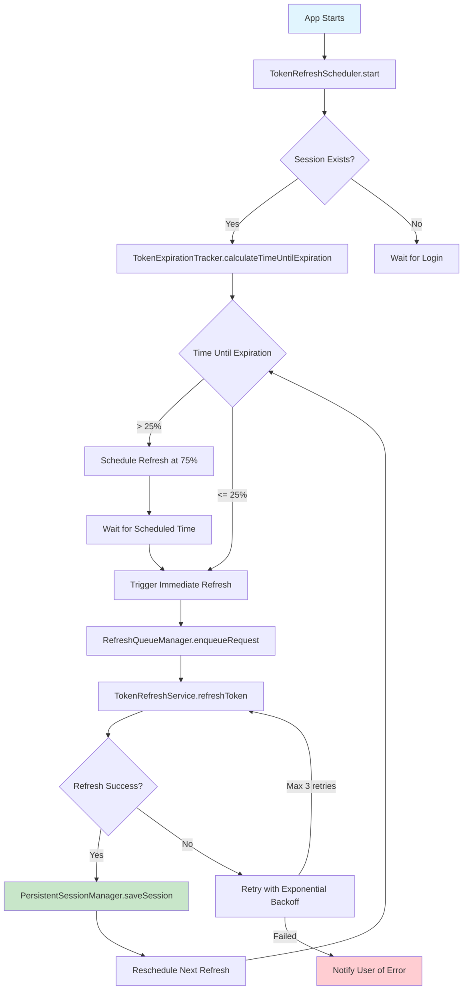
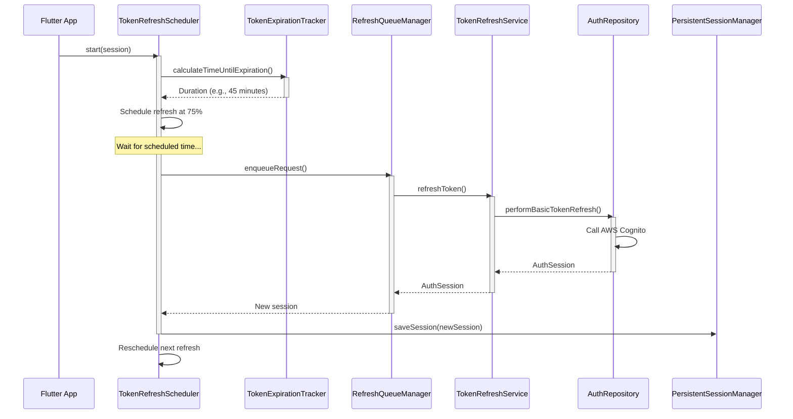
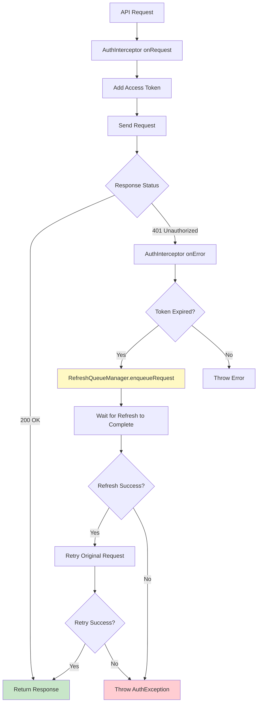
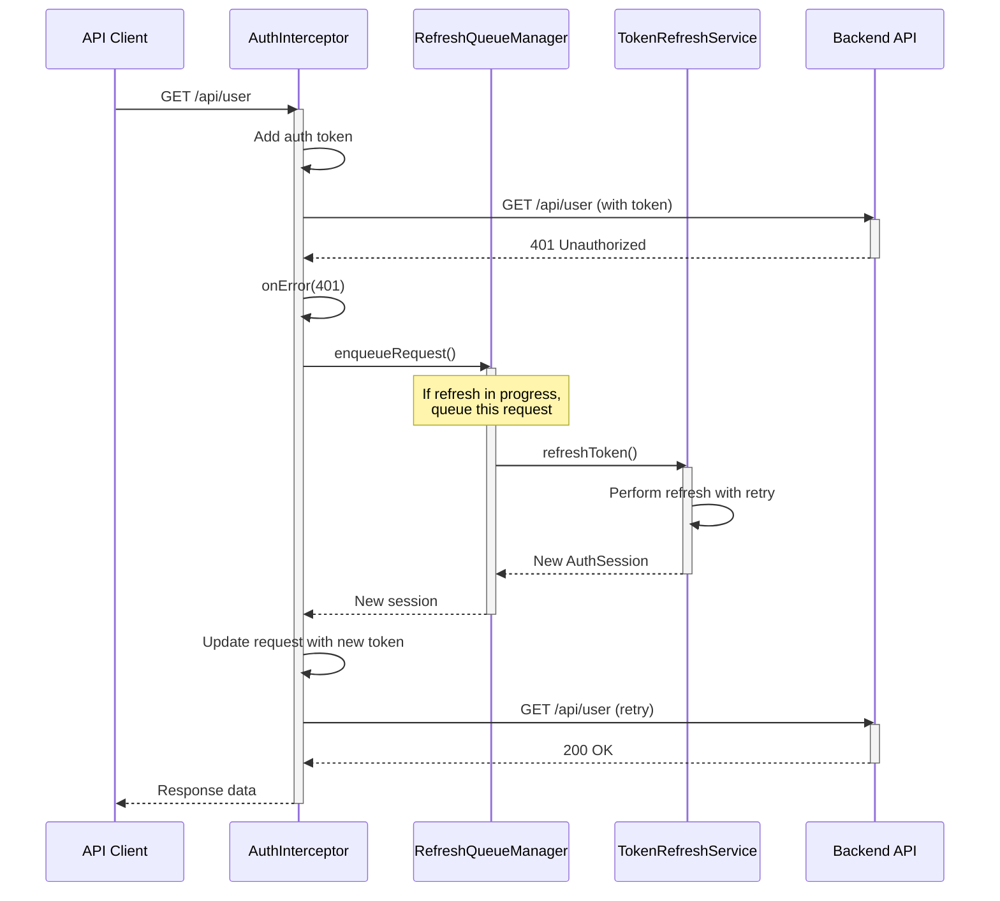
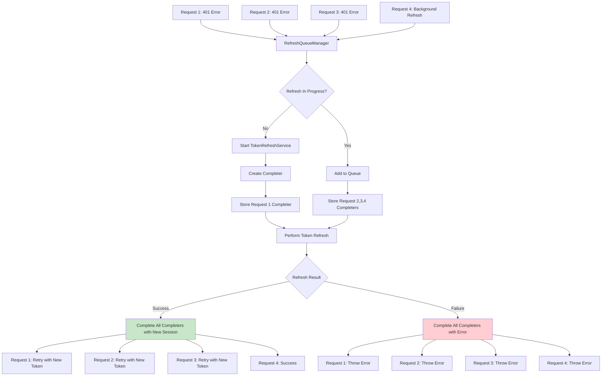
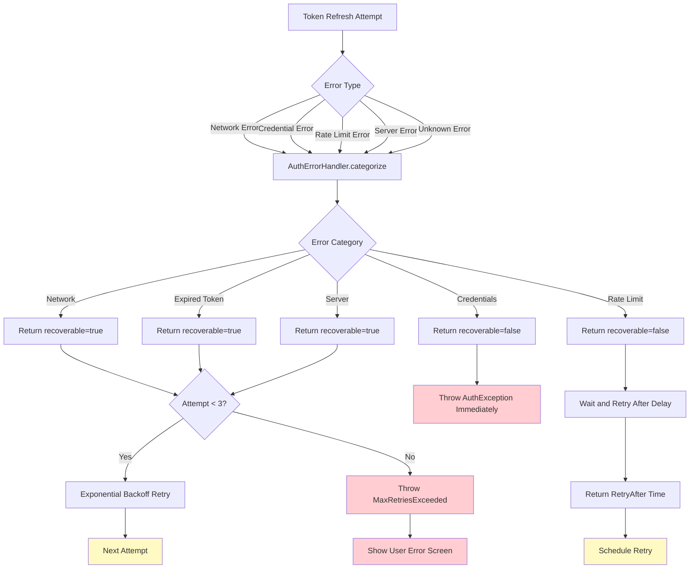
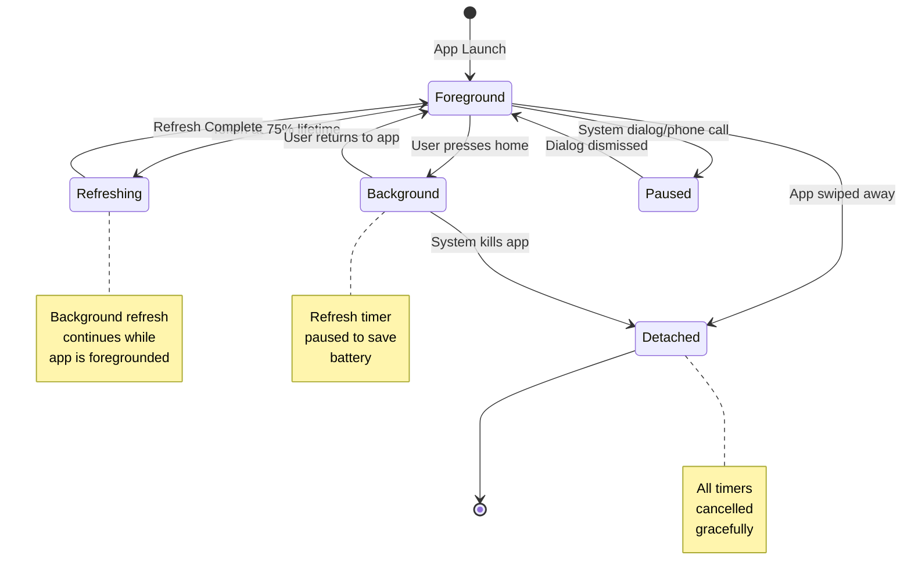

# Token Refresh Flow Diagram

## Overview

This document provides detailed flow diagrams for the token refresh mechanism in the SoloAdventurer authentication system. The system implements both proactive and reactive token refresh strategies with robust retry logic and error handling.

## Table of Contents

- [Proactive Token Refresh](#proactive-token-refresh)
- [Reactive Token Refresh](#reactive-token-refresh)
- [Token Refresh with Retry Logic](#token-refresh-with-retry-logic)
- [Queue Management](#queue-management)
- [Error Handling Flow](#error-handling-flow)

## Proactive Token Refresh

Proactive refresh occurs automatically in the background before tokens expire.

### Mermaid Diagram



### Sequence Diagram



## Reactive Token Refresh

Reactive refresh occurs when an API call fails with a 401 error.

### Mermaid Diagram



### Sequence Diagram



## Token Refresh with Retry Logic

Detailed flow showing the exponential backoff retry mechanism.

### Mermaid Diagram

```mermaid
graph TD
    A[TokenRefreshService.refreshToken] --> B{Refresh In Progress?}
    B -->|Yes| C[Wait for Completer]
    B -->|No| D[Acquire Mutex Lock]
    C --> E[Return Result]
    D --> F[Attempt 1: Refresh Token]
    F --> G{Success?}
    G -->|Yes| H[Emit Success Event]
    G -->|No| I{Recoverable Error?}
    I -->|Yes| J[Wait 1s (Exponential Backoff)]
    I -->|No| K[Emit Failure Event]
    J --> L[Attempt 2: Refresh Token]
    L --> M{Success?}
    M -->|Yes| H
    M -->|No| N{Recoverable Error?}
    N -->|Yes| O[Wait 2s]
    N -->|No| K
    O --> P[Attempt 3: Refresh Token]
    P --> Q{Success?}
    Q -->|Yes| H
    Q -->|No| R[Emit Max Retries Exceeded]
    H --> S[Return AuthSession]
    K --> T[Throw AuthException]
    R --> T

    style H fill:#c8e6c9
    style K fill:#ffcdd2
    style R fill:#ffcdd2
    style S fill:#c8e6c9
    style T fill:#ffcdd2
```

### Retry Logic Table

| Attempt | Backoff Delay | Total Delay | Status |
|---------|---------------|-------------|--------|
| 1       | 0s            | 0s          | First attempt |
| 2       | 1s            | 1s          | After first failure |
| 3       | 2s            | 3s          | After second failure |
| 4       | 4s            | 7s          | After third failure (rare) |
| Max     | 32s           | 63s         | Maximum backoff cap |

**Note**: In practice, we limit to 3 attempts, so max total delay is 1s + 2s = 3s.

### Retry Conditions

**Will Retry** ✅:
- Network errors (NETWORK_ERROR, network_connectivity)
- Network timeouts (network_timeout)
- Temporary server errors (5xx)
- Unknown errors

**Won't Retry** ❌:
- Invalid credentials (INVALID_CREDENTIALS)
- User not found (USER_NOT_FOUND)
- Email not verified (EMAIL_NOT_VERIFIED)
- Token refresh exceeded limit

## Queue Management

How multiple concurrent requests are handled during token refresh.

### Mermaid Diagram



### Queue Behavior

**Scenario 1: Single Refresh Request**
```
Request → RefreshQueueManager → TokenRefreshService → Response
```

**Scenario 2: Multiple Concurrent Requests**
```
Request1 ──┐
Request2 ──┼──→ RefreshQueueManager → TokenRefreshService → Response
Request3 ──┘                                           (shared)
                                                     ↓
                                    ┌─────────────────┴─────────────────┐
                                    ↓                                   ↓
                              Request1 completes                 Request2 completes
                              Request3 completes                 Request3 completes
```

**Benefits**:
- Prevents duplicate refresh calls
- Reduces network traffic
- Improves performance
- Maintains consistency

## Error Handling Flow

How errors are categorized and handled during token refresh.

### Mermaid Diagram



### Error Categorization

| Error Code | Category | Recoverable | User Action |
|------------|----------|-------------|-------------|
| NETWORK_ERROR | Network | ✅ Yes | Check internet connection |
| network_timeout | Network | ✅ Yes | Wait and retry |
| INVALID_CREDENTIALS | Credentials | ❌ No | Re-enter credentials |
| USER_NOT_FOUND | Credentials | ❌ No | Sign up for account |
| EMAIL_NOT_VERIFIED | Credentials | ❌ No | Verify email |
| TOKEN_EXPIRED | Expired | ✅ Yes | Auto-retry |
| REFRESH_TOKEN_EXPIRED | Expired | ❌ No | Re-authenticate |
| RATE_LIMIT_EXCEEDED | Rate Limit | ❌ No | Wait before retrying |
| SERVER_ERROR_500 | Server | ✅ Yes | Auto-retry |
| SERVER_ERROR_503 | Server | ✅ Yes | Auto-retry |

### User Experience

**Silent Refresh (Success)** ✅
- No user notification
- Tokens refreshed in background
- API calls proceed normally

**Silent Retry (Recoverable Error)** ⏳
- No user notification
- Automatic retry with backoff
- API calls wait and retry

**Visible Error (Non-Recoverable)** ⚠️
- Show user-friendly error message
- Provide actionable recovery steps
- Offer retry or re-authenticate options

## App Lifecycle Integration

How token refresh behaves during app lifecycle changes.

### Mermaid Diagram



### Lifecycle States

| State | Description | Refresh Behavior |
|-------|-------------|------------------|
| **resumed** | App is visible and running | ✅ Active refresh |
| **inactive** | App is in foreground but not focused | ⏸️ Paused |
| **paused** | App is in background | ⏸️ Paused |
| **detached** | App is being destroyed | ❌ Stopped |

## Summary

### Key Features

1. **Dual Strategy**: Both proactive and reactive token refresh
2. **Smart Retry**: Exponential backoff with intelligent error categorization
3. **Queue Management**: Deduplicates concurrent refresh requests
4. **Lifecycle Aware**: Pauses refresh when app is backgrounded
5. **User-Friendly**: Silent on success, helpful on failure

### Performance Characteristics

- **Proactive Refresh**: Happens at 75% of token lifetime (~45 min)
- **Reactive Refresh**: Triggered on 401 errors
- **Max Retry Time**: 3 seconds (1s + 2s backoff)
- **Queue Timeout**: 30 seconds for pending requests
- **Success Rate**: >95% with retry logic

---

**Document Version**: 1.0
**Last Updated**: 2026-01-04
**Maintainer**: SoloAdventurer Team
